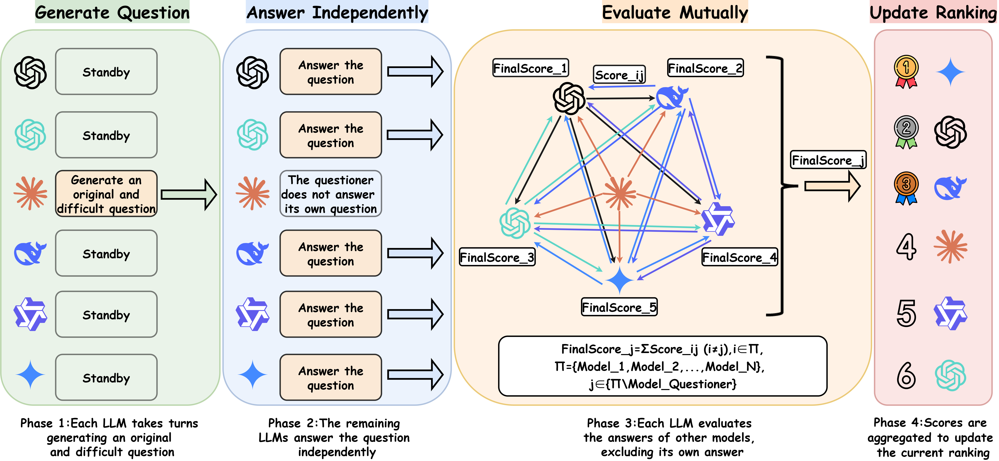

# LLM-Crowdsourced

**Full Paper Title**: LLM-Crowdsourced: A Benchmark-Free Paradigm for Mutual Evaluation of Large Language Models
 **Paper Link**: https://arxiv.org/abs/2507.22359

## Project Overview

LLM-Crowdsourced is an open-source experimental platform for large language model (LLM) mutual evaluation. It proposes a novel “benchmark-free” paradigm, in which multiple mainstream LLMs automatically generate questions for each other, answer each other's questions, and mutually evaluate each other's answers. This approach enables automatic generation of high-quality evaluation data and rankings without the need for human annotation or traditional benchmarks.
 The project supports both mathematics and programming experiments, automatically generates experimental reports and visualized results, and is suitable for LLM capability evaluation, comparative analysis, and academic research.


## Directory Structure

```
LLM-Crowdsourced/
│
├── exp/                        # Main experiment scripts and configuration
│   ├── config.py               # Config file: set API, LLMs, parameters, etc.
│   ├── models.py               # LLM API wrapper and invocation logic
│   ├── math_experiment.py      # Main script for math experiments
│   └── programming_experiment.py # Main script for programming experiments
│
├── data_processing/            # Data analysis and visualization scripts
│   ├── score.py                # Compute/visualize LLM scores
│   ├── Radar.py                # Generate capability radar charts
│   └── TOP-k.py                # Compute top-k overlap
│
├── assets/                     # Figures for the paper and experimental visualization
│   ├── methodology.png         # Methodology flowchart
│   ├── motivations.png         # Research motivation and background
│   ├── Radar.png               # Capability radar charts for all LLMs
│   └── score.png               # Score distribution/ranking visualization
│
├── results/                    # Experimental results (auto-generated, including JSON & Excel reports)
│   └── ...                     # Detailed process, scores, ranking for each experiment
│
├── requirements.txt            # Dependency list
└── Readme_cn.md                # Chinese README
└── Readme.md                   # English README
└── Appendix.pdf                # Appendix with concrete example demonstrations
```

---

## Quick Start

1. **Environment Preparation**
   - Python 3.8+
   - Install dependencies using: `pip install -r requirements.txt`
2. **Configuration**
   - Open `exp/config.py`, fill in your API_KEY and API_BASE.
   - Configure the LLMs for mutual evaluation in the `MODELS` list (multiple mainstream APIs supported, easy to add/remove).
   - You may set additional parameters such as streaming output, temperature, etc.
3. **Run Experiments**
   - Math experiment: `python exp/math_experiment.py`
   - Programming experiment: `python exp/programming_experiment.py`
   - Results will be automatically saved in the `results/` directory, including detailed processes, scores, rankings, and Excel reports.
4. **Analysis & Visualization**
   - In the`data_processing/`folder, use the following scripts for further analysis:
     - `score.py`: Summarize question/answer scores for each LLM, generate grouped bar charts (`score.pdf`).
     - `Radar.py`: Generate capability radar charts for all LLMs (`Radar.pdf`), showcasing multidimensional capability comparison.
     - `TOP-k.py`: Calculate top-k overlap between judges, to measure mutual evaluation consistency.
   - Related visualizations are saved in the current directory automatically.




## Main Features & Module Description

### 1. Configuration and LLM Management

- `exp/config.py`
   Centralized management of API keys, LLM list, experimental parameters (e.g., temperature, streaming output, etc.).
   Easily add or remove LLMs for horizontal comparison.
- `exp/models.py`
   Encapsulates LLM API calls, retry logic, streaming/non-streaming output processing, and supports multiple major LLMs.

### 2. math_experiment.py

- In each round, one LLM generates a question, other LLMs answer, and then all LLMs mutually evaluate the answers.
- Automatically extracts questions, reference answers, core concepts; all outputs provided in JSON format for further analysis.
- Automatically generates per-round and overall rankings, detailed scoring reasons, and Excel reports.
- Scoring mechanism: Each LLM ranks the others’ answers; scores are assigned based on ranking, supporting aggregation from multiple judges.

### 3. programming_experiment.py

- Follows a similar mechanism to the math experiments, but with original programming competition problems requiring complete code submissions.
- Automatically extracts problem statements, reference solutions, and grading criteria, with all LLMs mutually evaluating code quality.
- Supports multiple rounds and automated report generation.
- Scoring mechanism: Each LLM scores the other LLMs’ code submissions (percentage scale), with detailed rationale.

### 4. Data Analysis & Visualization (`data_processing/`)

- `score.py`: Calculate each LLM’s average answering and question score, generate grouped bar charts (`score.pdf`).
- `Radar.py`: Generate capability radar charts (`Radar.pdf`) from Excel results, intuitively displaying multidimensional capability.
- `TOP-k.py`: Calculate the top-k overlap rate between LLMs, evaluating agreement in mutual assessment.

### 5. Results & Visualization

- `results/`
  Automatically saves the detailed process of each experiment, all LLM answers, mutual evaluation rationale, scores, rankings, etc., in both JSON and Excel formats.
- `assets/`
  Stores paper figures and experimental visualizations, including methodology flowchart, motivation, capability radar charts, and score distributions.

------

## **Results File Visualization**


------

## Paper Citation

If this project is helpful for your work, please consider citing our paper:

```
@article{guo2025llm,
  title={LLM-Crowdsourced: A Benchmark-Free Paradigm for Mutual Evaluation of Large Language Models},
  author={Guo, Qianhong and Xie, Wei and Cai, Xiaofang and Wang, Enze and Ma, Shuoyoucheng and Chen, Kai and Wang, Xiaofeng and Wang, Baosheng},
  journal={arXiv preprint arXiv:2507.22359},
  year={2025}
}
```

------

## Contact & Contribution

- Suggestions, feedback, and collaboration are very welcome!
- Contact: [guoqianh1@nudt.edu.cn](mailto:guoqianh1@nudt.edu.cn)